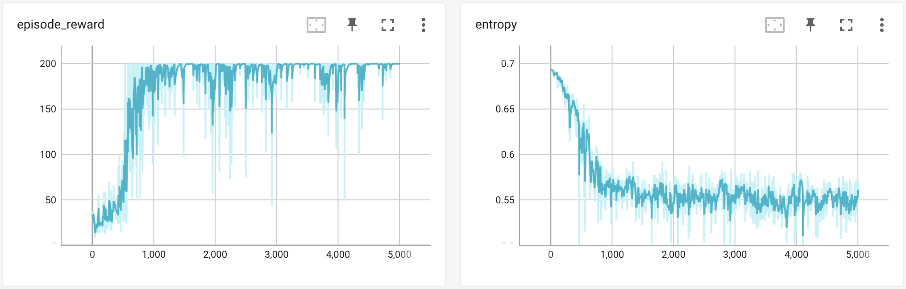
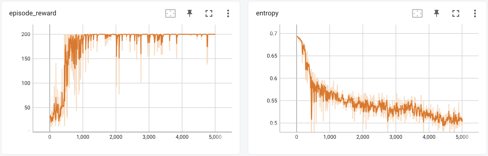
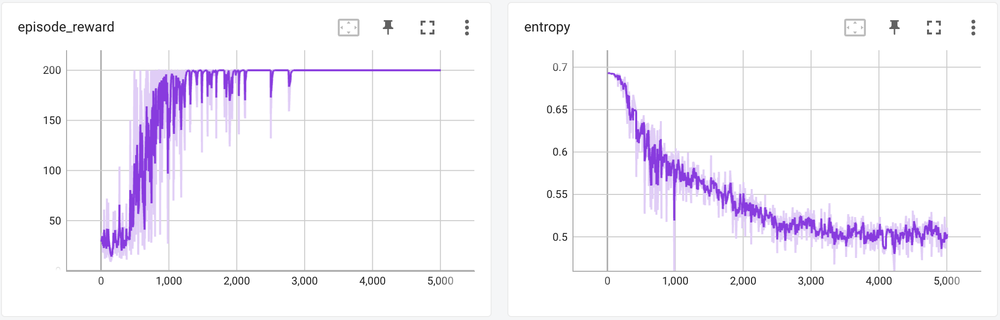
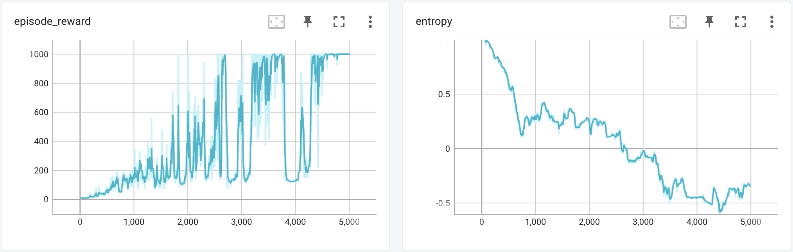
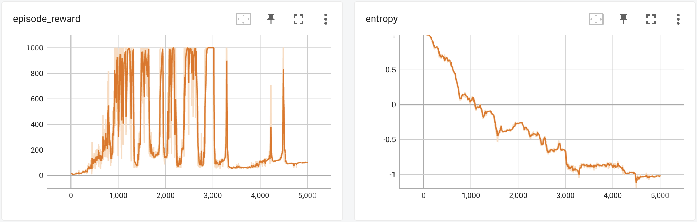
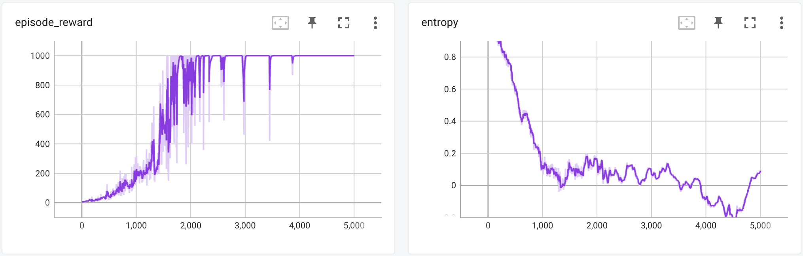
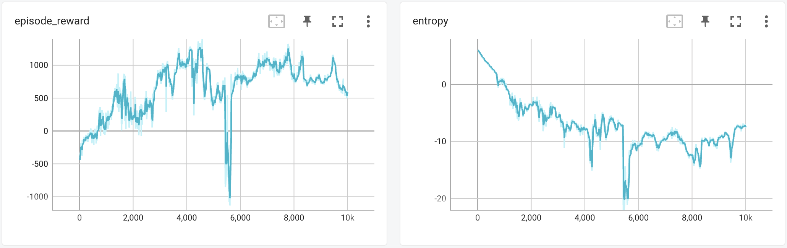
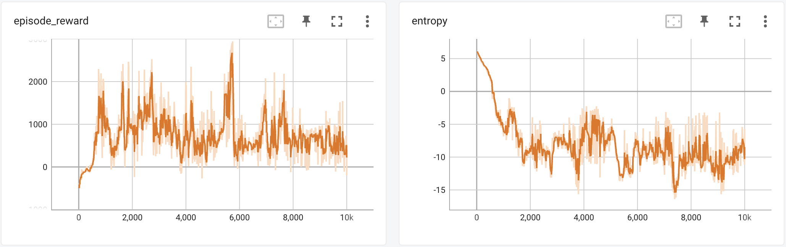
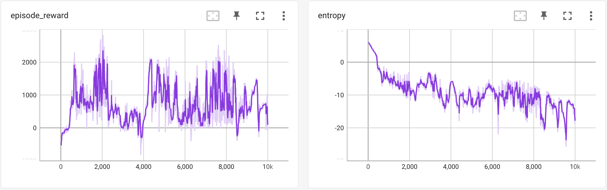

# A PyTorch Implementation of REINFORCE 

This is a PyTorch implementation of the REINFORCE (aka Vanilla Policy Gradient, Monte Carlo Policy Gradient) algorithm. It supports both discrete and continuous action space, and supports variance reduction techniques of baseline and advantage normalization.

Its performance on Cart Pole (1d discrete actions), Inverted Pendulum (1d continuous actions) and Half Cheetah (multi-dimensional continous actions) environements is plotted below. These lots are based on a policy network learning rate of 1e-4, baseline network learning rate of 1e-3, and gamma of 1 (except Half Cheetah where gamma = 0.9), and random seed = 42 (one of 5 random seeds used; tensorboard logs for all seeds can be found in the `results` directory).

## Cart Pole (CartPole-v0)
**Vanilla (no variance reduction techniques applied)**

**With baseline**

**With baseline + advantage normalization**


## Inverted Pendulum (InvertedPendulum-v4)
**Vanilla (no variance reduction techniques applied)**

**With baseline**

**With baseline + advantage normalization**


## Half Cheetah (HalfCheetah-v4)
**Vanilla (no variance reduction techniques applied)**

**With baseline**

**With baseline + advantage normalization**


# Usage
Installing dependencies
```
$ pip install -r requirements.txt
```

Train a model for a specific environment
```
python train.py <env>
```

# Reference Results
The `results` directory contains the tensorboard log files and video recordings for the 3 environments above.